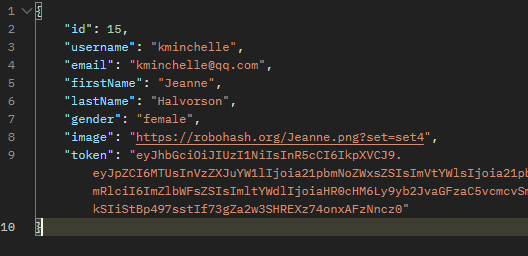

Professor Nicholas
[Github da aula de Context](https://github.com/nicholasmacedoo/atualizar-bifurcacao)
a partir da [template](https://github.com/FuturoDEV-Trip/M2S09-TEMPLATE-AULA2)

[M2S09] Ex. 2 - Contexto de autenticação de usuários
Neste exercício, você criará um contexto de autenticação para gerenciar o estado de autenticação de um usuário. O contexto deve incluir dois métodos e um estado para manter informações sobre a autenticação do usuário.

Estado:
Crie um estado para armazenar informações sobre a autenticação do usuário. Inicialize esse estado como null e, quando o usuário fizer login, utilize a seguinte estrutura

Ao utilizar a API Dummy para autenticação essa será a estrutura retornada pela API.

Métodos:
1º Método de SignIn:
Implemente um método chamado signIn que receba um objeto contendo as credenciais do usuário { username: 'string', password: 'string' }.
Simule uma autenticação com uma Promise (usando async/await), utilizando a FAKE API da Dummy.
Se a autenticação for bem-sucedida, persista as informações no localStorage para manter o estado entre as sessões do usuário.

2º Método de SignOut:
Implemente um método chamado signOut que não receba nenhum argumento nem retorna um valor. A função deve ser responsável por limpar todas as informações relacionadas à autenticação, tanto no estado quanto no localStorage. Este método é usado para encerrar a sessão do usuário e garantir que ele não tenha mais acesso às informações de autenticação após o logout.